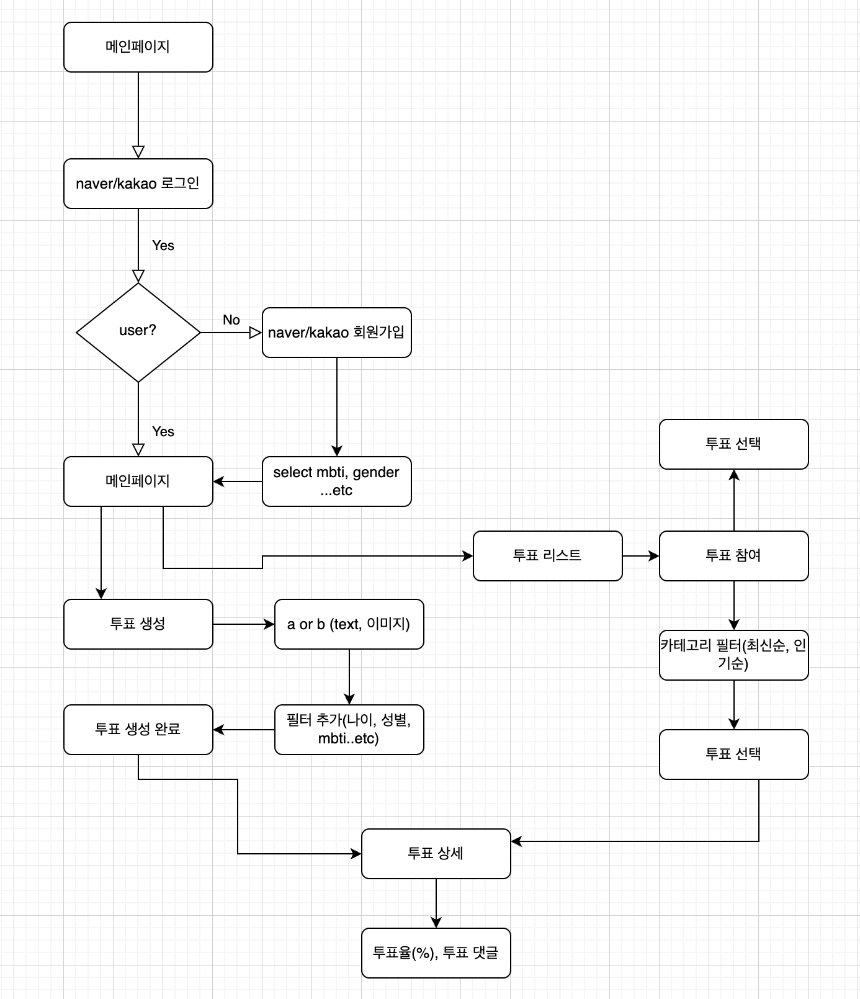

# 
 CHOOOZ 

 

## 기획의도 💡

 

## 핵심기능 💡

회원가입

    

    

투표 등록

    

통계

    

검색

    

유저 정보

    

 

## 🛠 기술 스택

 

## 프로젝트 구성도

 

## 프로젝트 순서도

## 데이터베이스 ERD

 

## API 문서
- https://chooz.co.kr/swagger-ui/index.html

 

## 💡 트러블 슈팅

 

## 프로젝트 설정 방법

 

### Front-End Repository
- [프론트엔드 Repository](https://github.com/choooz/client)
